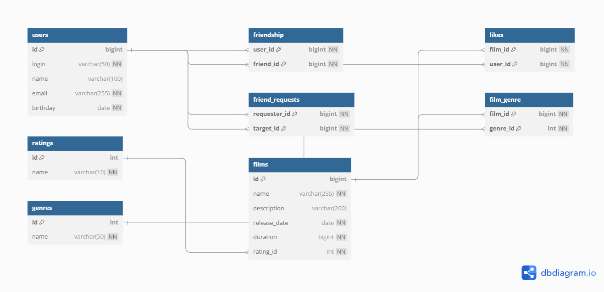

# Filmorate – Сервис для оценки фильмов

##  Диаграмма базы данных

Ниже представлена диаграмма, отображающая структуру базы данных проекта Filmorate. На ней отображены основные сущности: пользователи, фильмы, жанры, рейтинги, лайки, дружба и запросы в друзья.




##  Примеры SQL-запросов

###  Добавление пользователя
```sql
INSERT INTO users (login, name, email, birthday)
VALUES ('johndoe', 'John Doe', 'john@example.com', '1990-05-15');
